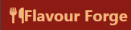
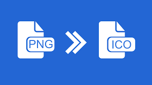

<a name="readme-top"></a>

<!--
*** Thank you for checking out and/or using this README Template. If you have a suggestion
*** that would make this better, please fork the repo and create a pull request
*** or simply open an issue with the tag "improvement".
*** Adapt appropriately and replace all placeholder text with accurate information relating to your project.
*** Don't forget to give the project a star!
-->

<!-- PROJECT LOGO -->
<br />
<div align="center">
  <a href="https://github.com/scientistigwe/README-Template">
    
  </a>

  <h1 align="center">Flavour Forge</h1>

  <p align="center">
    <br>
    Flavour Forge: A Global Culinary Repository
Flavour Forge project is about an ultimate destination for exploring and sharing culinary experiences from across the globe. As a comprehensive resource for recipes spanning diverse cultures and cuisines, the platform serves as a hub for culinary enthusiasts, home cooks, and professional chefs alike. It will allow users to discover, contribute, and experiment with a vast array of recipes, from traditional favorites to innovative creations. The project aims to foster a vibrant community of food lovers, providing a seamless and intuitive platform for discovering, sharing, and celebrating the rich tapestry of global gastronomy. Join us in the culinary journey of a lifetime with Flavour Forge.
    <br />
    <br />
    <a href="https://github.com/AmirAkmed/FlavorForge/blob/main/README.md"><strong>Explore the docs »</strong></a>
    <br />
    <br />

<!-- TABLE OF CONTENTS -->

Table of Contents

<!-- INTRODUCTION SECTION -->

  <details>
  <summary><a href="#introduction">SECTION 1: INTRODUCTION</a></summary>
        <li><a href="#about-the-project">About The Project</a>
        <li><a href='#ux'>User Experience (UX)</a></li>
        <li><a href='#user-stories'>User Stories</a></li>
        <li><a href="#technology-stack">Technology Stack</a></li>
        <li><a href="#languages-frameworks-libraries">Languages, Frameworks and Libraries</a></li>
        <li><a href="#management-and-development">Project Management and Development Approach</a></li>
    </details>
    <!-- PROJECT SETUP SECTION -->
    <details>
    <summary><a href="#project-setup">SECTION 2: PROJECT SETUP</a>
</summary>
        <li><a href="#prerequisites">Prerequisites</a></li>
        <li><a href="#installation">Installation</a></li>
    </details>
    <details>
    <summary><a href="#features-and-structure">SECTION 3: PROJECT FEATURES AND STRUCTURE</summary>
    <li><a href="#features">Features</a></li>
        <li><a href="#structure-and-navigation">Structure and Navigation</a></li>
        <li><a href="#wireframes">Wireframes</a></li>
         <li><a href="#design-and-styling">Design and Styling</a>
        <ol>
            <li><a href="#design">Design</a></li>
            <li><a href="#color">Color</a></li>
            <li><a href="#font">font</a></li>
            <li><a href="#media">media</a></li>
        </ol>
        </li>
</details>
<details>
<summary><a href="#testing-and-validation">SECTION 4: TESTING AND VALIDATION</a>
</summary>
    <li><a href="#testing">Testing</a></li>
        <li><a href="#validation">Validation</a>
        <ol>
        <li><a href="#html-validator-report">HTML Validator Report</a></li>
        <li><a href="#css-validator-report">CSS Validator Report</a></li>
        </ol>
        </li>
        <li><a href="#user-story-testing">User Story Testing</a></li>
        <li><a href="#bugs-and-issues">Bugs and Issues</a></li>
</details>
<details>
<summary><a href="#deployment-and-credits">SECTION 5: DEPLOYMENT AND CREDITS</a>
</summary>
        <li><a href="#final-product">Final Product</a></li>
        <li>
            <a href="#credits">Credits</a>
            <ol>
                <li><a href="#template">Template</a></li>
                <li><a href="#content">Content</a></li>
                <li><a href="#media2">Media</a></li>
            </ol>
        </li>
<li><a href="#acknowledgments">Acknowledgments</a></li>
<li><a href="#contact">Contact</a></li>
</details>

<!-- INTRODUCTION -->

#

<section>
<h1 id="introduction">SECTION 1: INTRODUCTION </h1>

This section contains summary information about the project, the user expections and tools used in building this solution.

<h2 id="about-the-project">About The Project</h2>

<p align="center"><a href="https://amirakmed.github.io/FlavorForge/">Visit our site: Flavour Forge</a></p>

<a href="https://github.com/AmirAkmed/FlavorForge/blob/main/README.md">

</a>


<h2 id="ux">User Experience (UX)</h2>

****Flavour Forge**** is a website designed to provide easy and convenient access to a world of cuisines from international sources.

The uniqueness of this project are:

- abc
- xyz
- 123
- etc

You can view the deployed website [here](https://amirakmed.github.io/FlavorForge/)

<h2 id="user-stories">User Stories</h2>


As a user I want Navbar to be able to easily navigate between pages

As a user role, I want footer with social media links, so that I can access the social media pages for the site.

As a user , I want a carousel hero image, so that I can see straight away a variety of images of the foods I could learn to make from this site.

As Flavour Forge I want a carousel hero image with descriptions on, to entice the user to want to know more about the recipes we can provide.

As a user , I want a submission form, so that I can share my own recipes.

As a user , I want a gallery, so that so that I can take inspiration for what to cook next.

As Flavour Forge I want a gallery to capture the attention and imagination of the user.

As a user, I want clearly separated recipe cards, so that I can clearly read the recipes provided.

As a user I want Nav buttons for the different sections on the recipe page so that I can easily navigate to the recipes I’m interested in.

As a user I want prep time on the recipe cards so I know how much time to set aside for cooking.

As a user I want images on the recipe cards so that I can see what the dish looks like and decide whether I’m interested in making it.

As a user, I want to follow Flavour Forge on Twitter, Facebook, YouTube etc.

As Flavour Forge I want  a submission form, so that I can gather more content to put out.

As Flavour Forge I want to collect the name and email on the submission form, so that I can contact the person who submitted the recipe if clarification is needed.

As Flavour Forge I want to separate sections for recipe name, ingredients and instructions on the submission form, so that I can easily move the content into a pre-formatted recipe template.


<h2 id="technology-stack">Technology Stack</h2>

This subsection outlines the technologies, frameworks, libraries, and tools used in the development of this project. It provides insight into the foundational components that power "**Flavour Forge**". Add-ons ad plugins are captured in the acknowledgements subsection.

<h2 id="languages-frameworks-libraries">Languages, Frameworks and Libraries</h2>

- <a href="https://en.wikipedia.org/wiki/HTML5"> HTML5</a> - Used for designing the structure of the project.

- <a href="https://en.wikipedia.org/wiki/CSS"> CSS3</a> - Used for styling the project.

- <a href="https://fonts.google.com/"> Google Fonts</a> - Provides all of the fonts for this website.

- <a href="https://fontawesome.com/"> Font Awesome</a> - Used for the site icons.

- <a href="https://en.wikipedia.org/wiki/JavaScript"> JavaScript</a> - Used for the hamburger navigation and icons.

- <a href="https://github.com/IrisSmok"> Github</a> - Used to store the project code.

- <a href="https://www.gitpod.io/"> Gitpod</a> - An IDE Used for coding.

- <a href="https://balsamiq.com/"> Balsamiq</a> - Used to create site wireframes.

- <a href="https://www.shutterstock.com/home"> Shutterstock</a> and <a href="https://unsplash.com/"> Unsplash photo</a> - Used for all images on the website.


- <a href="http://ami.responsivedesign.is/"> Am I Responsive</a> - Used to check if the site is responsive on different screen sizes.

- <a href="https://www.img2go.com/compress-image#j=f26cc008-23b4-4d4e-9934-96877fa9a7e7"> IMG2GO</a> and <a href="https://tinypng.com/"> Tiny PNG</a> - Used to help compress the images.

- <a href="https://www.freeformatter.com/html-formatter.html"> Free Online HTML Formatter</a> - Used to correct indentation issues and get rid of excess whitespace.


- <a href="[Bootstrap-url]"> Bootstrap</a> - Used for building responsive and mobile-first websites and web applications.


<h2 id="management-and-development">Project Management and Development Approach</h2>

This project was implemented using the Agile Manifesto methodology. Below are the ways this project adhered to the 4 core values and 12 core principles of the Agile Methodolgy:

<strong>Four Values of the Agile Manifesto:</strong>

- Vision 1: Customer collaboration over contract negotiation: **Extensive research was carried on recipes that had popular demand** The Team held [**frequent meetings were held everyday to ensure we were meeting our objects and on target for completion** planning sessions via **Slack, Zoom, Google Meet, or Microsoft Teams**, ensuring alignment with customer needs and prioritizing features through user story mapping.
- **a screenshot or graphic representation of a Zoom meeting with team members.**

- Vision 2: Responding to change over following a plan: **[Sample description]**: Throughout the project, the team managed (
  [](https://github.com/github-username/name-of-repository/issues) + [](https://github.com/github-username/name-of-repository/issues) ) GitHub issues, adapting to changing requirements and feedback iteratively.
  **A screenshot of the GitHub project board demonstrates their flexibility.**

- Vision 3: Working software over comprehensive documentation: **[Sample description]** Achieved **[number of story points]** across **[number of sprints]**, emphasizing the focus on delivering functional software increments.
- **A snapshot of the scrum/kanban board tracks their progress.**

- Vision 4: Individuals and interactions over processes and tools
  Description: Daily interactions on GitHub led to **[number of commits]**, fostering collaboration and knowledge sharing among team members.
- **A snapshot of GitHub issue discussions illustrates their collaborative environment.**

<strong>Twelve Principles of the Agile Manifesto</strong>

- Satisfy the customer: Held regular stakeholder meetings to ensure alignment with customer needs.
- Deliver working software: Prioritized delivering functional increments in each sprint, allowing for early feedback.
- Welcome changing requirements: Maintained open communication channels and adapted plans iteratively.
- Collaborate daily: Conducted **(frequency of standup) stand-up** meetings to facilitate collaboration and problem-solving.
- Face-to-face conversation: Utilized **in-person and/or virtual meetings (select one or all the options)** to enhance clarity and understanding.
- Motivated individuals: Empowered team members through skill development and recognition.
- Measure progress through working product: Evaluated progress based on delivered functionality in each sprint.
- Promote sustainable development: Prioritized sustainability practices to ensure long-term success.
- Simplicity is essential: Used MoSCoW prioritization and focused on MVP delivery to avoid unnecessary complexity.
- Continuous attention to technical excellence: Adopted show and tell technique to ensure all team members learn while collaborating.
- Self-organizing team: Encouraged autonomy and collaboration within the team.
- Regular reflection on continuous improvement: Conducted regular retrospectives to identify areas for improvement.

<p align="right">(<a href="#readme-top">back to top</a>)</p>

<!-- PROJECT SETUP -->

#

<h1 id="project-setup">SECTION 2: PROJECT SETUP</h1>

In this section, a detailed account of all requirements needed for "**name-of-project**" to be setup and running. It also includes installation instructions and a link to all necessary documentations for these tools.

<h2 id="prerequisites">Prerequisites</h2>

Below are the list of softwares required to setup and start using "**name-of-project**" (N/B: if no installation is required. Then write: "**name-of-project**" does not rely on any external dependencies or services.):

- npm
  ```sh
  npm install npm@latest -g
  ```
- etc

<h2 id="installation">Installation</h2>

_Below is an example of how you can instruct your audience on installing and setting up your app. This template doesn't rely on any external dependencies or services._

1. Get a free API Key at [https://example.com](https://example.com)
2. Clone the repo
   ```sh
   git clone https://github.com/your_username_/Project-Name.git
   ```
3. Install NPM packages
   ```sh
   npm install
   ```
4. Enter your API in `config.js`
   ```js
   const API_KEY = "ENTER YOUR API";
   ```

<p align="right">(<a href="#readme-top">back to top</a>)</p>

#

<h1 id="features-and-structure">SECTION 3: PROJECT FEATURES AND STRUCTURE</h1>

This section encompasses the various elements and functionalities aimed at enhancing the user experience and achieving the goals of ["**name-of-project**"] website. It outlines the key features and structural components intended to provide visitors with a seamless and informative journey through the platform.

<h1 id="features">Features</h1>

The key features are:

- <strong>Navigation:</strong> Designed to facilitate users effortlessly access to different sections and pages.
- <strong>Services:</strong> Provides comprehensive information about the services offered by the project.
- <strong>Pricing:</strong> Provides corresponding prices on services offered by ["**name-of-project**"], enabling users to make informed decisions about their choices.
- <strong>Testimonials:</strong> Showcases testimonials and highlights positive experiences from previous clients, fostering trust and credibility among potential customers.
- <strong>Gallery:</strong> Presents a visually appealing gallery displaying a pictorial representation of ["**name-of-project**"], serving as a source of inspiration for clients.
- <strong>Contact Form:</strong> Offers a user-friendly contact form that simplifies the process of reaching out to the team. This will empower clients to submit inquiries, book appointments, or provide feedback seamlessly.
- <strong>Contact Information:</strong> Displays essential contact details of the team prominently on the website, ensuring users can easily reach out to the establishment via phone, email, or physical address.
- <strong>Social Links:</strong> Includes links to the company's social media profiles, enabling users to stay connected and updated with the latest news, promotions, and announcements.
- <strong>Responsive Design:</strong> Ensures that the website is accessible and functional across various devices and screen sizes, providing a consistent user experience.
- <strong>Interactive Elements:</strong> Incorporates interactive elements such as buttons, sliders, and hover effects to enhance user engagement and interactivity, making the browsing experience more enjoyable and intuitive.

- Other features to be implemented in the future include:

- <strong>Online Booking:</strong> Implementing an online booking system that enables clients to schedule appointments directly through the website, offering convenience and flexibility in selecting desired dates and times for their visits.

- <strong>ChatBot:</strong>: An AI-powered self service system that will guide and direct clients based on their specific needs.

<h2 id="structure-and-navigation">Structure and Navigation</h2>

- **File Organisation**

  - The files where structured into folders and clustered based on functionality. Also file naming convention that reflects the functions of the conetent of the file was adopted.

- **Header**

  - "**name-of-project**" logo positioned [left|right|center]
  - Appears on every page

- **Nav bar**

  - Appers on every page
  - Navigation bar on the [left|right|center]

- **Menu items**

  - Appers on every page
  - Directs users to specific page

- **Footer**

  - Includes a [contact information, contact form, newsletter, Resources and social links] (N/B: adjust as appropriate)
  - Appears on every page

- **Home Page**
  - _Hero image_ - appears at the top-[left|right|center] of the home page, below the header section.
  - _Testimonials_ - just below the "**name-of-section**" section, responsively arrange to maximize various device screen width and give users a good experience.
  - _Call to action buttons_ - provides an easy portal to other specific page of "**name-of-project**".
- **Services** - Services has a dedicated page with a navigation link on both the navbar and one of the call-to-action buttons on the homepage.
- **Pricing** - Pricing and Plans has a dedicated page with a navigation link on both the navbar and one of the call-to-action buttons on the homepage.
- **Our Team** - Our Teams has a dedicated page with a navigation link on both the navbar and one of the call-to-action buttons on the homepage.
- **Gallery** - Gallery has a dedicated page with a navigation link on both the navbar and one of the call-to-action buttons on the homepage.
- **Contact Us** - This is located at the [left|right|center] of the footer.

<h2 id="wireframes">Wireframes</h2>

### _File Organisation Tree_

<p align="center">

</p>

### _Home Page_

<p align="center">

</p>

### _Services & Prices_

<p align="center">

</p>

### _OurTeam_

<p align="center">

</p>

### _Gallery_

<p align="center">

</p>

### _Contact Us_

<p align="center">

</p>

### _Mobile View - Home Page_

<p align="center">

</p>

<h2 id="design-and-styling">Design and Styling</h2>

<h3 id="design">Design</h3>

Given the serene ambiance of the establishment, the website echoes this sentiment through its design. Employing a predominantly white background conveys cleanliness, brightness, and sterility—attributes associated with a tranquil setting. Complementary background hues evoke a sense of calmness, while vibrant and colorful imagery aims to immerse visitors in the **[name of project]** ambiance.

<h3 id="color">Color</h3>

- **Main background color - **#color hex** (color name)** - I chose this color because **\*\***\***\*\***
- **h1 headings and nav bar - [color]** - reason
- **h2 headings - [color]** - reason
- **p - [color]** - reason
- **footer - [color]** - reason

<h3 id="font">Font</h3>

- main font: Font name
- Secondary font - Font name

<h3 id="media">Media</h3>

**Hero image** - short description and reason for selection

**Contact section** - short description and reason for selection

**Services** - short description and reason for selection

**Plans and Pricing** - short description and reason for selection

**Our Team** - short description and reason for selection

**Gallery** - short description and reason for selection

**Contact Us** - short description and reason for selection

**etc** - short description and reason for selection

<p align="right">(<a href="#readme-top">back to top</a>)</p>

#

<h1 id="testing-and-validation">SECTION 4: TESTING AND VALIDATION</h1>
- In this section, the functionalities of the final product was tested and validated to ensure consistency with user stories.
<h2 id="testing">Testing</h2>

- **Browser Compatibility Testing:** Ensured compatibility with Chrome, Opera, Microsoft Edge, and Firefox desktop browsers.

- **Responsiveness Testing:** Utilized Chrome Developer Tools to verify responsiveness across multiple devices: Desktop, Laptop, Moto G4, Galaxy S5, iPhone 5/SE, iPhone 6/7/8, iPhone 6/7/8 Plus, iPad, iPad Pro, Galaxy Fold

<h2 id="validation">Validation</h2>

The W3C Markup Validator and W3C CSS Validator Services were used to check my code for syntax errors in this project.

- [HTML](https://validator.w3.org/#validate_by_input)- I checked each page by direct input method on HTML validator site

<p align="center">

</p>

- [CSS](https://jigsaw.w3.org/css-validator/)

<p align="center">

</p>

- I used Lighthouse tools to test my website
<p align="center">

</p>

<h3 id="html-validator-report">HTML Validator Report</h3>

- _Warning_ : [details of any warning]

  - [actions taken to remedy it].

- _Value Error_ : [details of any error]

  - [actions taken to remedy it].

<h3 id="css-validator-report">CSS Validator Report</h3>

- _Warning_ : [details of any warning]

  - [actions taken to remedy it].

- _Value Error_ : [details of any error]

  - [actions taken to remedy it].

<h2 id="user-story-testing">User Story Testing</h2>

- **User Story 1:** [user story here]

  - [how it was implemented here]

  (N/B: Use image generated from https://ui.dev/amiresponsive to show the the page in 4 different devices)

  <p align="center">
  
  </p>

- **User Story 2:** [user story here]

  - [how it was implemented here]

  (N/B: Use image generated from https://ui.dev/amiresponsive to show the the page in 4 different devices)

  <p align="center">
  
  </p>

reapeat for all user stories

<h2 id="bugs-and-issues">Bugs and Issues</h2>

- Detail any bug and/or issues encountered, steps taken to correct it. Add images if possible.

<p align="right">(<a href="#readme-top">back to top</a>)</p>

#

<h2 id="deployment-and-credits">SECTION 5: DEPLOYMENT AND CREDITS</h2>

-In this section, the tested and validated product will be deployed and external resources used during this exercise will be mentioned.

<h2 id="final-product">Final Product</h2>

- The product is live and can be seen on **[url of deployed site]**

### _Home Page_

<p align="center">

</p>

- Add images of various sections of the final product as above.

<h2 id="credits">Credits</h2>

<h3 id="template">Template</h3>

- This template was adopted and adapted from README.md templates published by <a href="https://github.com/scientistigwe/README-Template" alt="Github page of Chibueze C. Igwe" target="_blank">Chibueze C. Igwe</a>, <a href="https://github.com/Iris-Smok/Vannas-Beauty-Salon_PP1" alt="Github page of Iris Smok" target="_blank">Iris Smok</a> and <a href="https://github.com/othneildrew/Best-README-Template" alt="Github page of Othneil Drew" target="_blank">Othneil Drew</a>.

<h3 id="content">Content</h3>

- All content was written by [**Your Name**]
- Mention sections that was not original and the source where it was adopted from.

- I utilized the guidance provided by [Responsive navbar and hamburger menu](https://dev.to/devggaurav/let-s-build-a-responsive-navbar-and-hamburger-menu-using-html-css-and-javascript-4gci) to develop the responsive navbar and hamburger menu.

<h3 id="media2">Media</h3>

- All images were taken from [Shutterstock](https://www.shutterstock.com/home) and [Unsplash photo](https://unsplash.com/)

<!-- ACKNOWLEDGMENTS -->
<h2 id="acknowledgments">Acknowledgments</h2>

Use this space to list individuals, groups or resources you find helpful and would like to give credit to. I've included a few of my favorites to kick things off!

- [Choose an Open Source License](https://choosealicense.com)
- [GitHub Emoji Cheat Sheet](https://www.webpagefx.com/tools/emoji-cheat-sheet)
- [Malven's Flexbox Cheatsheet](https://flexbox.malven.co/)
- [Malven's Grid Cheatsheet](https://grid.malven.co/)
- [Img Shields](https://shields.io)
- [GitHub Pages](https://pages.github.com)
- [Font Awesome](https://fontawesome.com)
- [React Icons](https://react-icons.github.io/react-icons/search)

<!-- CONTACT -->

<h2 id="contact">Contact</h2>

Your Name - [@your_twitter](https://twitter.com/your_username) - email@example.com

Project Link: [https://github.com/your_username/repo_name](https://github.com/your_username/repo_name)

<p align="right">(<a href="#readme-top">back to top</a>)</p>
</section>
